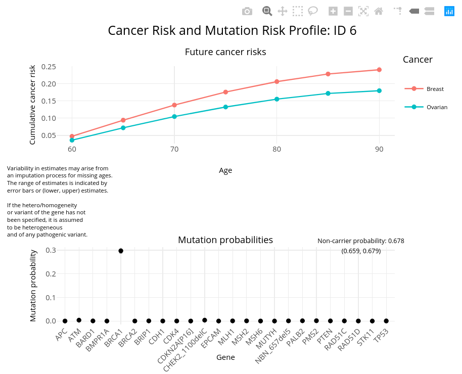

<!-- README.md is generated from README.Rmd. Please edit that file -->

# PPP R package

The PPP R package extends the BayesMendel R package to
multi-syndrome, multi-gene Mendelian risk prediction modeling.

## Installation

### Install the cbcrisk R package

The package cbcrisk version 2.0 is a dependency of PPP v1.0.0 and
higher. Prior to using PPP, you can install it manually using the
instructions below otherwise, it will install automatically from GitHub
the first time you run the `PPP()` function or another model
function (ie `BRCAPRO()`).

#### Installation via a tar.gz or .zip file:

The tar.gz and .zip files for cbcrisk v2.0 can be found
[here](https://personal.utdallas.edu/~sxb125731/).

On Linux, enter the following into your terminal:

    R CMD INSTALL CBCRisk_2.0.tar.gz

On Windows, enter following into our R console:

    install.packages("[PATH]/CBCRisk_2.0.zip", repos = NULL, type = "source")

#### Installation via GitHub

On GitHub, cbcrisk v2.0 can be found
[here](https://github.com/ihsajal/CBCRisk). Note that the commit SHA in
the code below is confirmed to be compatible with PPP as of
Feb. 23rd, 2023.

    devtools::install_github("ihsajal/CBCRisk@44f7b5ee801a0b4e09977e3f5645e17a38cc7598")

### Install PPP from source

If you are installing PPP from source and running Linux, enter the
following into the terminal:

    R CMD INSTALL PanelPRO_X.X.X.tar.gz

For Windows, enter the following into your R console:

    install.packages("[your PPP file path]/PanelPRO_X.X.X.zip", repos = NULL, type = "source")

where `X.X.X` corresponds to the version number you have downloaded.

## Quick-start guide

This following is a quick-start guide for basic usage of the `PPP`
package. For greater detail on model options, please refer to the other
vignettes and documentation, e.g
`vignette("building-pedigrees", package = "PPP")` or
`help(PPP)`.

The primary function in the package is the eponymous `PPP`, which
outputs the posterior carrier probabilities and future risk of cancer of
one or more probands, based on the user-supplied `pedigree` and model
specification (either `model_spec` or explicit specification of `genes`
and `cancers`).

``` r
library(PPP)
#> Welcome to the PPP package, by the BayesMendel Lab!
#> PPP version: 1.0.0
#>    ___                _____  ___  ____  
#>   / _ \___ ____  ___ / / _ \/ _ \/ __ \ 
#>  / ___/ _ `/ _ \/ -_) / ___/ , _/ /_/ / 
#> /_/   \_,_/_//_/\__/_/_/  /_/|_|\____/
```

### Pedigree

The user must specify the `pedigree` argument as a data frame with the
following columns:

- `ID`: A numeric value; ID for each individual. There should not be any
  duplicated entries.
- `Sex`: A numeric value; `0` for female and `1` for male. Missing
  entries are not currently supported.
- `MotherID`: A numeric value; unique ID for someone’s mother.
- `FatherID`: A numeric value; unique ID for someone’s father.
- `isProband`: A numeric value; `1` if someone is a proband, `0`
  otherwise. This will be overridden by the `proband` argument in
  `PPP`, if it is specified. At least one proband should be
  specified by either the `isProband` column or `proband`. Multiple
  probands are supported.
- `CurAge`: A numeric value; the age of censoring (current age if the
  person is alive or age of death if the person is dead). Ages ranging
  from `1` to `94` are allowed.
- `isAffX`: A numeric value; the affection status of cancer `X`, where
  `X` is a `short` cancer code (see below). Affection status should be
  encoded as `1` if the individual was diagnosed, `0`otherwise. Missing
  entries are not currently supported.
- `AgeX`: A numeric value; the age of diagnosis for cancer `X`, where
  `X` is a `short` cancer code (see below). Ages ranging from `1` to
  `94` are allowed. If the individual was not diagnosed for a given
  cancer, their affection age should be encoded as `NA` and will be
  ignored otherwise.
- `isDead`: A numeric value; `1` if someone is dead, `0` otherwise.
  Missing entries are assumed to be `0`.
- `race`: A character string; expected values are `"All_Races"`,
  `"AIAN"` (American Indian and Alaska Native), `"Asian"`, `"Black"`,
  `"White"`, `"Hispanic"`, `"WH"` (white Hispanic), and `"WNH"`
  (non-white Hispanic) (see `PPP:::RACE_TYPES`). Asian-Pacific
  Islanders should be encoded as `"Asian"`. Race information will be
  used to select the cancer and death by other causes penetrances used
  in the model. Missing entries are recoded as the `unknown.race`
  argument, which defaults to `PPP:::UNKNOWN_RACE`.
- `Ancestry`: A character string; expected values are `"AJ"`, `"nonAJ"`,
  and `"Italian"` (see `PPP:::ANCESTRY_TYPES`). Ancestry
  information will be used to select the allele frequencies used in the
  model. Missing entries are recoded as the `unknown.ancestry` argument,
  which defaults to `PPP:::UNKNOWN_ANCESTRY`.
- `Twins`: A numeric value; `0` for non-identical/single births, `1` for
  the first set of identical twins/multiple births in the family, `2`
  for the second set, etc. Missing entries are assumed to be `0`.
- Prophylactic surgical history columns: as of PPP v1.1.0, there
  are two ways to encode prophylactic surgical history for mastectomies,
  hysterectomies, and oophorectomies which are explained below. These
  preventative interventions will be used to modify the cancer
  penetrances for breast, endometrial, and ovarian cancer, respectively.
  Note that in order to be considered prophylactic, mastectomies and
  oophorectomies must have been bilateral.
  - The first method has been utilized since the initial release of
    PPP and uses two list type columns:
    - `riskmod`: A character list; expected values are `"Mastectomy"`,
      `"Hysterectomy"`, and `"Oophorectomy"` (see
      `data.frame(PPP:::RISKMODS)`).
    - `interAge`: A numeric list; the age of intervention for each risk
      modifier in `riskmod`. For example,
      `riskmod = list("Mastectomy", "Hysterectomy")` and
      `interAge = {45, 60}` indicates that the individual had a
      mastectomy at age 45 and a hysterectomy at age 60. Unknown surgery
      ages should be `NA`.
  - The second method, which is only compatible with PPP v1.1.0 or
    higher, uses six different numeric columns to replace the `riskmod`
    and `interAge` list type columns. This newer method makes sharing
    and storing pedigrees as .csv files easier because list type columns
    are not compatible with .csv files. The naming conventions for the
    six new columns are `riskmodX` (3 columns) and `interAgeX` (3
    columns), where “X” is one of the 3 abbreviated surgery names
    `"Mast"`, `"Ooph"`, or `"Hyst"`:
    - `riskmodX` A binary value; `1` if the surgery occurred and `0`
      otherwise.
    - `interAgeX` A numeric value; the age of the corresponding
      intervention for `riskmodX`. For example, if `riskmodMast = 1` and
      `interAgeMast = 45` the individual had a bilateral prophylactic
      mastectomy at age 45. Unknown surgery ages should be coded as
      `NA`.
- There can be optional columns for germline testing results
  (e.g. `BRCA1`, `MLH1`) or tumor marker testing results. `ER`, `PR`,
  `CK14`, `CK5.6` and `HER2` are tumor markers associated with breast
  cancer that will modify the likelihood of phenotypes associated with
  `BRCA1` and `BRCA2`. `MSI` is a tumor marker for colorectal cancer
  that will modify the likelihoods associated with `MLH1`, `MSH2` `MSH6`
  and `PMS2`. For each of these optional columns, positive results
  should be coded as `1`, negative results should be coded as `0`, and
  unknown results should be coded as `NA`.
- There are optional columns related to breast cancer which provide more
  accurate estimates for contralateral breast cancer risk. These columns
  are:
  - `FirstBCType`: Breast cancer type of the first primary breast
    cancer. The only options are `Invasive` for pure invasive and
    `Invasive_DCIS` for mixed invasive and DCIS. There is no option for
    pure DCIS (see “Additional Notes” section). Use `NA` if no first
    primary breast cancer or unknown type.
  - `AntiEstrogen`: Anti-estrogen therapy used to treat first primary
    breast cancer. The options are `0` for no, `1` for yes, and `NA` for
    unknown or for those never diagnosed with breast cancer.
  - `HRPreneoplasia`: History of high risk preneoplasia (ie atypical
    hyperplasia or LCIS). The options are `0` for no, `1` for yes, and
    `NA` for unknown or for those never diagnosed with breast cancer.
  - `BreastDensity`: BI-RADS breast density descriptor. The options are
    the letters `a` through `d`. `a` = almost entirely fatty, `b` =
    scattered areas of fibroglandular density, `c` = heterogeneously
    dense, and `d` = extremely dense. If the breast density is unknown,
    use `NA`.
  - `FirstBCTumorSize`: Size category of the first primary breast cancer
    tumor. The only options are `"T0/T1/T2"`, `"T3/T4"`, `"Tis"`. Use
    `NA` for unknown tumor size or if there was no first primary breast
    cancer.

To represent a cancer in `pedigree`, we need to use `short` cancer
codes:

``` r
data.frame(PPP:::CANCER_NAME_MAP)
#>    short                long
#> 1    BRA               Brain
#> 2     BC              Breast
#> 3    COL          Colorectal
#> 4   ENDO         Endometrial
#> 5    GAS             Gastric
#> 6    KID              Kidney
#> 7   LEUK            Leukemia
#> 8   MELA            Melanoma
#> 9     OC             Ovarian
#> 10   OST        Osteosarcoma
#> 11  PANC            Pancreas
#> 12  PROS            Prostate
#> 13    SI     Small Intestine
#> 14   STS Soft Tissue Sarcoma
#> 15   THY             Thyroid
#> 16    UB     Urinary Bladder
#> 17   HEP       Hepatobiliary
#> 18   CBC       Contralateral
```

For example, `BC` is the `short` name that maps to `Breast`, so breast
cancer affection status and age of diagnosis should be recorded as
columns named `isAffBC` and `AgeBC`.

Note `Contralateral` indicates contralateral breast cancer (`CBC`).

Unknown values in `pedigree` should be explicitly coded as `NA`.

Before computing anything, the `PPP` function will check the
validity and structural consistency of `pedigree`. Errors will be
corrected when possible, or the function will halt with an informative
error message if not.

The `PPP` package comes with several sample pedigrees, each of
which contains family history information. For example, `err_fam_1` is a
pedigree that will fail the validity checks and `test_fam_1` is a valid
pedigree that contains 19 relatives and family history for breast and
ovarian cancer:

``` r
head(test_fam_1)
#>   ID Sex MotherID FatherID isProband CurAge isAffBC isAffOC AgeBC AgeOC isDead
#> 1  1   0       NA       NA         0     93       1       0    65    NA      1
#> 2  2   1       NA       NA         0     80       0       0    NA    NA      1
#> 3  3   0        1        2         0     72       1       1    40    NA      0
#> 4  4   1        1        2         0     65       0       0    NA    NA      1
#> 5  5   1        1        2         0     65       0       0    NA    NA      0
#> 6  6   0        1        2         1     55       0       0    NA    NA      0
#>        race      riskmod interAge Twins BRCA1 BRCA2 ER CK5.6 CK14 PR HER2
#> 1 All_Races                           0    NA    NA NA    NA   NA NA   NA
#> 2 All_Races                           0     1     0 NA    NA   NA NA   NA
#> 3 All_Races   Mastectomy       28     0    NA    NA NA    NA   NA NA   NA
#> 4 All_Races                           1     1    NA NA    NA   NA NA   NA
#> 5 All_Races                           1    NA    NA NA    NA   NA NA   NA
#> 6 All_Races Hysterectomy       48     0    NA    NA  0    NA   NA NA   NA
#>   Ancestry
#> 1    nonAJ
#> 2    nonAJ
#> 3       AJ
#> 4    nonAJ
#> 5    nonAJ
#> 6    nonAJ
```

For more information on the sample pedigrees, see their individual help
pages. For an example of building a pedigree, see the vignette on
“Building PPP Pedigrees”.

### Model specification

There are a few ways to specify the model to be run by `PPP`. The
first is to pass a character string to `model_spec` that indicates a
pre-specified model. Available options are:

``` r
names(PPP:::MODELPARAMS)
#> [1] "BRCAPRO"  "BRCAPRO5" "BRCAPRO6" "MMRPRO"   "PanPRO11" "PanPRO22"
```

The genes and cancers that these models specify can be found by
accessing the named list element in `PPP:::MODELPARAMS`. For
example, the 22 genes and 17 cancers specified by `"PanPRO22"` are:

``` r
PPP:::MODELPARAMS$PanPRO22
#> $GENES
#>  [1] "ATM"    "BARD1"  "BRCA1"  "BRCA2"  "BRIP1"  "CDH1"   "CDK4"   "CDKN2A"
#>  [9] "CHEK2"  "EPCAM"  "MLH1"   "MSH2"   "MSH6"   "MUTYH"  "NBN"    "PALB2" 
#> [17] "PMS2"   "PTEN"   "RAD51C" "RAD51D" "STK11"  "TP53"  
#> 
#> $CANCERS
#>  [1] "Brain"               "Breast"              "Colorectal"         
#>  [4] "Endometrial"         "Gastric"             "Kidney"             
#>  [7] "Leukemia"            "Melanoma"            "Ovarian"            
#> [10] "Osteosarcoma"        "Pancreas"            "Prostate"           
#> [13] "Small Intestine"     "Soft Tissue Sarcoma" "Thyroid"            
#> [16] "Urinary Bladder"     "Hepatobiliary"       "Contralateral"
```

For convenience, the `PPP` package exports wrapper functions for
all of the pre-specified models: `BRCAPRO`, `BRCAPRO5`, `BRCAPRO6`,
`MMRPRO`, `PanelPRO11`, and `PanelPRO22`.

Alternatively, the user can explicitly pass in genes to the `genes`
argument and cancers to the `cancers` argument. If the inputs conflict
with each other, `genes` and `cancers` will override the `model_spec`
specification. Available genes are:

``` r
PPP:::GENE_TYPES
#>  [1] "ATM"    "BARD1"  "BRCA1"  "BRCA2"  "BRIP1"  "CDH1"   "CDK4"   "CDKN2A"
#>  [9] "CHEK2"  "EPCAM"  "MLH1"   "MSH2"   "MSH6"   "MUTYH"  "NBN"    "PALB2" 
#> [17] "PMS2"   "PTEN"   "RAD51C" "RAD51D" "STK11"  "TP53"
```

Available cancers are:

``` r
PPP:::CANCER_TYPES
#>  [1] "Brain"               "Breast"              "Colorectal"         
#>  [4] "Endometrial"         "Gastric"             "Kidney"             
#>  [7] "Leukemia"            "Melanoma"            "Ovarian"            
#> [10] "Osteosarcoma"        "Pancreas"            "Prostate"           
#> [13] "Small Intestine"     "Soft Tissue Sarcoma" "Thyroid"            
#> [16] "Urinary Bladder"     "Hepatobiliary"       "Contralateral"
```

Therefore, it is equivalent to run:

- `PPP(pedigree, model_spec = "PanPRO22", ...)`
- `PanelPRO22(pedigree, ...)`
- `PPP(pedigree, genes = PPP:::MODELPARAMS$PanPRO22$GENES, cancers = PPP:::MODELPARAMS$PanPRO22$CANCERS, ...)`

By default, `PPP` without any user-specified `model_spec`, `genes`,
or `cancers` will run `PanelPRO22`, so it is also equivalent in this
case to simply write `PPP(pedigree, ...)`. Cancers for which no
family history is available in the pedigree will be dropped from the
model specification, under the default settings.

### Additional notes

- The `PPP` function pulls model parameters, including mutation
  allele frequencies and cancer penetrances, from the `database`
  argument. The internal `PanelPRODataBase` is used by default, but
  users can override it by passing in their own database.

- The optional `proband` argument allows the user to specify the IDs for
  one or more probands for whom carrier probabilities and future risk
  should be estimated, overriding the contents of the `isProband` column
  in `pedigree`. If `proband = "All"`, the results for all individuals
  in the pedigree will be calculated.

- The `PPP` function returns a list with two elements,
  `posterior.prob` and `future.risk`. By default, `PPP` imputes 20
  iterations of missing ages (`impute.missing.ages = TRUE` and
  `iterations = 20`). When missing ages are multiply imputed,
  `posterior.prob` and `future.risk` report the average and range of the
  results from these imputations.

- The `max.mut` argument sets the maximum number of simultaneous
  mutations allowed. By default, `max.mut` will be set to `2` when
  `pedigree` has 30 or fewer members and `1` when `pedigree` exceeds 30
  members. For example, if `max.mut = 2`, a model that includes MLH1,
  MSH2, and MSH6 will estimate the carrier probability of being a
  carrier of both MLH1 and MSH2 (or of both MLH1 and MSH6, or of both
  MSH2 and MSH6), but not of being a carrier of MLH1, MSH2, and MSH6
  simultaneously. Choosing a large value for `max.mut`, especially when
  there is a large number of genes in the model, may result in slow
  performance.

- The `age.by` argument determines the fixed age intervals for the
  future risk calculations. By default, `age.by = 5`, so if the
  proband’s current age is 30, future risk will be calculated at ages
  35, 40, 45, etc.

- All breast cancers are assumed to be invasive or mixed invasive and
  DCIS. Pure DCIS breast cancers are not compatible with PPP.

### Example usage

All three of the following expressions are equivalent calls that fit the
`BRCAPRO` model to the `test_fam_1` pedigree. The resulting posterior
carrier probabilities and future risk estimates for the proband (taken
from the `test_fam_1$isProband` column to be the individual with ID `6`)
are identical.

``` r
# Pass in BRCAPRO as the model specification
out1 <- PPP(pedigree = test_fam_1, 
                 model_spec = "BRCAPRO")
#> Contralateral cancer(s) not in pedigree, so they will be removed from the model specification.
#> Your model has 2 cancers - Breast, Ovarian and 2 genes - BRCA1_hetero_anyPV, BRCA2_hetero_anyPV.
#> Setting max.mut to 2.
#> ID 6,29 has tumor marker testing results but is unaffected for relevant cancer, so testing will be ignored.
#> Germline testing results for BRCA1 are assumed to be for default variant BRCA1_hetero_anyPV.
#> Germline testing results for BRCA2 are assumed to be for default variant BRCA2_hetero_anyPV.
#> ID 3 's Ancestry has been changed to nonAJ to meet hereditary consistency.
#> ID 10 's race has been changed to All_Races to meet hereditary consistency.
#> ID 9 's Ancestry has been changed to nonAJ to meet hereditary consistency.
#> ID 16,17 's Ancestry has been changed to nonAJ to meet hereditary consistency.
#> ID 29,30 's Ancestry has been changed to nonAJ to meet hereditary consistency.
#> ID 33,34 's race has been changed to All_Races to meet hereditary consistency.
#> ID 33,34 's Ancestry has been changed to nonAJ to meet hereditary consistency.
#> ID 6's lower and upper bounds for the probability of carrying any pathogenic variant are (0.30599, 0.30604).
#> The value ranges in the results are driven by the different imputed missing ages at each imputation, so please consider including more age information when possible to reduce the range widths.

# Explicitly specify the genes and cancers in BRCAPRO
out2 <- PPP(pedigree = test_fam_1, 
                 genes = c("BRCA1", "BRCA2"), 
                 cancers = c("Breast", "Ovarian"))
#> Your model has 2 cancers - Breast, Ovarian and 2 genes - BRCA1_hetero_anyPV, BRCA2_hetero_anyPV.
#> Setting max.mut to 2.
#> ID 6,29 has tumor marker testing results but is unaffected for relevant cancer, so testing will be ignored.
#> Germline testing results for BRCA1 are assumed to be for default variant BRCA1_hetero_anyPV.
#> Germline testing results for BRCA2 are assumed to be for default variant BRCA2_hetero_anyPV.
#> ID 3 's Ancestry has been changed to nonAJ to meet hereditary consistency.
#> ID 10 's race has been changed to All_Races to meet hereditary consistency.
#> ID 9 's Ancestry has been changed to nonAJ to meet hereditary consistency.
#> ID 16,17 's Ancestry has been changed to nonAJ to meet hereditary consistency.
#> ID 29,30 's Ancestry has been changed to nonAJ to meet hereditary consistency.
#> ID 33,34 's race has been changed to All_Races to meet hereditary consistency.
#> ID 33,34 's Ancestry has been changed to nonAJ to meet hereditary consistency.
#> ID 6's lower and upper bounds for the probability of carrying any pathogenic variant are (0.30599, 0.30604).
#> The value ranges in the results are driven by the different imputed missing ages at each imputation, so please consider including more age information when possible to reduce the range widths.
stopifnot(all.equal(out1, out2))

# Pre-defined model wrapper for BRCAPRO
out3 <- BRCAPRO(pedigree = test_fam_1)
#> Contralateral cancer(s) not in pedigree, so they will be removed from the model specification.
#> Your model has 2 cancers - Breast, Ovarian and 2 genes - BRCA1_hetero_anyPV, BRCA2_hetero_anyPV.
#> Setting max.mut to 2.
#> ID 6,29 has tumor marker testing results but is unaffected for relevant cancer, so testing will be ignored.
#> Germline testing results for BRCA1 are assumed to be for default variant BRCA1_hetero_anyPV.
#> Germline testing results for BRCA2 are assumed to be for default variant BRCA2_hetero_anyPV.
#> ID 3 's Ancestry has been changed to nonAJ to meet hereditary consistency.
#> ID 10 's race has been changed to All_Races to meet hereditary consistency.
#> ID 9 's Ancestry has been changed to nonAJ to meet hereditary consistency.
#> ID 16,17 's Ancestry has been changed to nonAJ to meet hereditary consistency.
#> ID 29,30 's Ancestry has been changed to nonAJ to meet hereditary consistency.
#> ID 33,34 's race has been changed to All_Races to meet hereditary consistency.
#> ID 33,34 's Ancestry has been changed to nonAJ to meet hereditary consistency.
#> ID 6's lower and upper bounds for the probability of carrying any pathogenic variant are (0.30599, 0.30604).
#> The value ranges in the results are driven by the different imputed missing ages at each imputation, so please consider including more age information when possible to reduce the range widths.
stopifnot(all.equal(out1, out3))
```

The `visRisk` function provides interactive visualizations for exploring
the proband(s)’s carrier probabilities and future risk estimates
returned by `PPP`. For example,

``` r
visRisk(out1)
```



`PanelPRO11` runs an 11 gene, 11 cancer model. `test_fam_2` is a more
complex pedigree with 25 relatives and information on endometrial,
pancreatic, and small intestine cancer. By default, the cancers that are
not included in the pedigree will be dropped from the model
specification. Carrier probabilities will therefore be estimated based
on family history of endometrial, pancreatic, and small intestine
cancer; future risk estimates will only be given for these three
cancers.

``` r
out4 <- PanelPRO11(pedigree = test_fam_2)
#> Brain, Breast, Colorectal, Gastric, Kidney, Melanoma, Ovarian, Prostate, Contralateral cancer(s) not in pedigree, so they will be removed from the model specification.
#> Your model has 3 cancers - Endometrial, Pancreas, Small Intestine and 11 genes - BRCA1_hetero_anyPV, BRCA2_hetero_anyPV, ATM_hetero_anyPV, PALB2_hetero_anyPV, CHEK2_hetero_1100delC, EPCAM_hetero_anyPV, PMS2_hetero_anyPV, MLH1_hetero_anyPV, MSH2_hetero_anyPV, MSH6_hetero_anyPV, CDKN2A[P16]_hetero_anyPV.
#> Setting max.mut to 2.
#> ID 12's lower and upper bounds for the probability of carrying any pathogenic variant are (0.18282, 0.25576).
#> ID 19's lower and upper bounds for the probability of carrying any pathogenic variant are (0.10647, 0.14387).
#> ID 21's lower and upper bounds for the probability of carrying any pathogenic variant are (0.04728, 0.04934).
#> The value ranges in the results are driven by the different imputed missing ages at each imputation, so please consider including more age information when possible to reduce the range widths.
```

`out2` contains results for the three probands specified by the
`isProband` column in `fam25`. We can extract the results for a specific
proband, e.g. the one with `ID = 12`.

``` r
head(out4$posterior.prob$`12`)
#>                   genes     estimate        lower        upper
#> 1            noncarrier 0.7862760882 0.7442372677 0.8171816929
#> 2    BRCA1_hetero_anyPV 0.0009420256 0.0009121588 0.0009630147
#> 3    BRCA2_hetero_anyPV 0.0010629569 0.0010320276 0.0010863401
#> 4      ATM_hetero_anyPV 0.0030277342 0.0029323624 0.0030951922
#> 5    PALB2_hetero_anyPV 0.0008971822 0.0008710650 0.0009169285
#> 6 CHEK2_hetero_1100delC 0.0043207063 0.0041660817 0.0044303642

out4$future.risk$`12`
#> $Endometrial
#>    ByAge   estimate      lower      upper
#> 1     49 0.01133006 0.00953546 0.01382722
#> 2     54 0.03238989 0.02722494 0.03958295
#> 3     59 0.06009958 0.05068241 0.07320253
#> 4     64 0.08249396 0.07018836 0.09955262
#> 5     69 0.09418568 0.08118970 0.11208450
#> 6     74 0.10062249 0.08772854 0.11826668
#> 7     79 0.10498755 0.09222464 0.12237341
#> 8     84 0.10786272 0.09518549 0.12508302
#> 9     89 0.10942380 0.09679517 0.12655370
#> 10    94 0.10999928 0.09739079 0.12709479
#> 
#> $Pancreas
#>    ByAge     estimate        lower        upper
#> 1     49 0.0005381908 0.0004860642 0.0006117279
#> 2     54 0.0014148118 0.0012887253 0.0015924263
#> 3     59 0.0028634411 0.0026154834 0.0032126670
#> 4     64 0.0051014429 0.0046596368 0.0057239684
#> 5     69 0.0081994916 0.0074999414 0.0091853703
#> 6     74 0.0117457437 0.0107899961 0.0130922158
#> 7     79 0.0153317598 0.0141921358 0.0169357311
#> 8     84 0.0183264326 0.0170970105 0.0200550145
#> 9     89 0.0204984458 0.0192487633 0.0222542152
#> 10    94 0.0215754010 0.0203364406 0.0233155908
#> 
#> $`Small Intestine`
#>    ByAge    estimate       lower       upper
#> 1     49 0.001426245 0.001165799 0.001792689
#> 2     54 0.003190522 0.002623869 0.003985722
#> 3     59 0.005204334 0.004316200 0.006444637
#> 4     64 0.007393643 0.006176663 0.009086996
#> 5     69 0.009509772 0.007988545 0.011622333
#> 6     74 0.011385919 0.009599729 0.013865538
#> 7     79 0.012799079 0.010814630 0.015556873
#> 8     84 0.013798228 0.011682139 0.016741988
#> 9     89 0.014272380 0.012103188 0.017291318
#> 10    94 0.014381484 0.012207102 0.017407885
```

Finally, we can run PPP-22 (the default for `PPP`) on
`test_fam_3`, which has 50 relatives and stores family history for the
11 cancers specified by PPP-11. Note that because there are more
than 30 relatives in `test_fam_3`, the `max.mut` argument, which sets
the maximum number of simultaneous mutations allowed, defaults to `1`
instead of `2`. We set `proband = 10`, overriding the proband
information encoded in `test_fam_3$isProband`.

``` r
out5 <- PPP(pedigree = test_fam_3, proband = 10)
#> Leukemia, Osteosarcoma, Soft Tissue Sarcoma, Thyroid, Urinary Bladder, Hepatobiliary, Contralateral cancer(s) not in pedigree, so they will be removed from the model specification.
#> Your model has 11 cancers - Brain, Breast, Colorectal, Endometrial, Gastric, Kidney, Melanoma, Ovarian, Pancreas, Prostate, Small Intestine and 22 genes - ATM_hetero_anyPV, BARD1_hetero_anyPV, BRCA1_hetero_anyPV, BRCA2_hetero_anyPV, BRIP1_hetero_anyPV, CDH1_hetero_anyPV, CDK4_hetero_anyPV, CDKN2A[P16]_hetero_anyPV, CHEK2_hetero_1100delC, EPCAM_hetero_anyPV, MLH1_hetero_anyPV, MSH2_hetero_anyPV, MSH6_hetero_anyPV, MUTYH_hetero_anyPV, MUTYH_homo_anyPV, NBN_hetero_657del5, PALB2_hetero_anyPV, PMS2_hetero_anyPV, PTEN_hetero_anyPV, RAD51C_hetero_anyPV, RAD51D_hetero_anyPV, STK11_hetero_anyPV, TP53_hetero_anyPV.
#> Setting max.mut to 1.
#> `proband` argument does not match with "isProband" column in the pedigree, using `proband`
#> Riskmods that are NA will be removed
#> Warning: ID 14 is male but has been affected by OC; turning into non-affection.
#> ID 10's lower and upper bounds for the probability of carrying any pathogenic variant are (0.9246, 0.97597).
#> The value ranges in the results are driven by the different imputed missing ages at each imputation, so please consider including more age information when possible to reduce the range widths.
```
